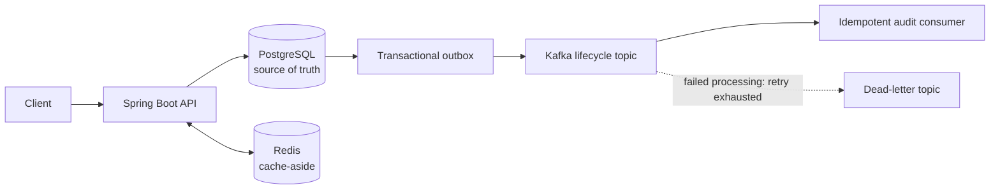

# CampusReserve

CampusReserve is a backend-focused event registration system for limited-capacity
university events. It demonstrates how to keep reservations correct when many
people reserve, cancel, retry, and join a waitlist at the same time.

**Java 21 · Spring Boot · PostgreSQL · Redis · Kafka · Docker · OpenTelemetry · Prometheus · k6 · Terraform · AWS · GitHub Actions**

Campus events are the product context; the implemented application provides an
event, reservation, and waitlist API. It does not ingest events from official
campus systems.

## Why CampusReserve

A limited-capacity event looks simple until concurrent requests, temporary
holds, cancellations, waitlists, and asynchronous notifications interact.
CampusReserve keeps PostgreSQL authoritative for capacity and reservation state
while treating caching and messaging as supporting concerns rather than sources
of correctness.

## Architecture



- PostgreSQL row locking serializes capacity changes; Redis is an event-read
  cache only and is never used for reservation locking.
- Reservation mutations write lifecycle events to a PostgreSQL outbox in the
  same transaction. Kafka downtime leaves durable pending work instead of
  failing the reservation transaction.
- Kafka delivery is **at-least-once**, not exactly-once. The audit consumer
  stores processed event IDs in PostgreSQL, so duplicate deliveries do not
  repeat its side effect; bounded retries route exhausted records to a DLT.
- Expiration and waitlist work run in bounded batches and use `SKIP LOCKED`
  where implemented to avoid competing workers processing the same rows.

## Key engineering features

- Pessimistic PostgreSQL locking prevents overbooking under concurrent holds.
- `Idempotency-Key` protects reservation creation from retry-induced duplicate
  capacity consumption and rejects conflicting key reuse.
- Reservation lifecycle: `HELD`, `CONFIRMED`, `CANCELLED`, and `EXPIRED`.
- Ten-minute holds, FIFO waitlist promotion, and active-reservation eligibility
  checks on capacity release.
- Redis cache-aside event reads with PostgreSQL fallback and targeted cache
  invalidation after capacity changes.
- Transactional outbox, stable event IDs, Kafka retries/DLT, and database-backed
  consumer idempotency.
- Actuator health/Prometheus metrics, correlation IDs, and optional OTLP tracing.
- Dockerized local dependencies, GitHub Actions verification, and immutable
  commit-SHA container publishing to GHCR on trusted `main` pushes.
- Terraform defines a cost-conscious AWS demo topology without claiming a
  running application deployment.

## Verified local-development results

These are local-development measurements, not production benchmarks.

- **Capacity correctness:** 500 simultaneous attempts for an event with capacity
  100 produced exactly 100 holds, 400 expected capacity rejections, remaining
  capacity 0, and no overbooking.
- **Idempotency correctness:** 100 concurrent identical requests with one key
  resulted in one reservation and one capacity decrement.
- **Event reads:** 7,627 requests at 331.30 req/s with p95 8.35 ms and zero
  HTTP failures.
- **Mixed workload:** 3,865 requests at 256.29 req/s with p95 20.85 ms and
  zero HTTP failures.
- **Failure exercises:** Redis outage fell back to PostgreSQL; Kafka outage
  allowed the reservation to commit with a pending outbox record that recovered
  after Kafka returned; PostgreSQL outage made readiness fail and prevented
  normal database-backed writes until recovery.

See [the methodology and full local results](docs/06-performance-and-failure-testing.md).

## Reservation flow

1. Create an event with `POST /api/events`.
2. Create a hold with `POST /api/events/{eventId}/reservations` and an
   `Idempotency-Key` header.
3. Confirm with `POST /api/reservations/{reservationId}/confirm`, or cancel
   with `POST /api/reservations/{reservationId}/cancel`.
4. Cancellation or expiration releases capacity and promotes the oldest eligible
   waiting attendee when one exists. Waitlist entry is
   `POST /api/events/{eventId}/waitlist`.

Useful reads are `GET /api/events`, `GET /api/events/{id}`,
`GET /api/reservations/{reservationId}`, and `GET /api`.

## Quick start

Prerequisites: Java 21, Docker Desktop/Compose, and a local checkout.

```bash
docker compose up -d postgres redis kafka
cd apps/reservation-api
./mvnw spring-boot:run
```

In another terminal, confirm database-backed readiness and the API:

```bash
curl http://localhost:8080/actuator/health/readiness
curl http://localhost:8080/api
```

The default local services are PostgreSQL on `5434`, Redis on `6380`, and Kafka
on `9094`. Stop only the local dependencies when finished with
`docker compose down` from the repository root.

Run the full test suite:

```bash
cd apps/reservation-api
./mvnw test
```

Load and dependency-failure harnesses are documented in
[load-tests/README.md](load-tests/README.md). They operate on the local Compose
services and do not represent production capacity tests.

## Testing and CI

The Maven suite covers API behavior, persistence, idempotency, locking and
concurrency, cache fallback/invalidation, outbox publication, consumer
deduplication/retry/DLT, expiration, and waitlist promotion. GitHub Actions
validates Compose and harness syntax, starts PostgreSQL/Redis/Kafka, runs Maven
verification, builds the production-oriented image, and smoke-checks its
database-backed readiness. On trusted pushes to `main`, it publishes immutable
commit-SHA and `main` tags to GHCR; pull requests never publish images.

Build the same image locally:

```bash
docker build -t campusreserve/reservation-api:local apps/reservation-api
```

## AWS and Terraform

Terraform defines the intended short-lived demo path:
**ALB → ECS/Fargate → RDS PostgreSQL, ElastiCache Redis, and MSK Kafka**, plus
ECR, Secrets Manager, IAM, CloudWatch, and private data services.

- **Defined:** the topology and manual deployment runbook in Terraform.
- **Validated/planned:** the main stack; its real plan contained 53 additions.
- **Actually deployed:** only the encrypted, versioned, non-public remote-state
  S3 bootstrap bucket.

The application stack was intentionally not applied: no RDS, Redis, MSK, ECS,
ALB, or NAT Gateway is running. The validating Free-plan account could not use
MSK without an account-plan upgrade, so work stopped before potentially paid
deployment. A future operator must review billing, service eligibility, and the
plan before any apply. See [AWS architecture status](docs/07-aws-deployment.md)
and [the Terraform runbook](infra/aws/README.md).

## Repository guide

```text
apps/reservation-api/  Spring Boot API, Flyway migrations, and tests
load-tests/            k6 scenarios and local failure/recovery scripts
docs/                  Performance/failure evidence and AWS deployment status
infra/aws/             Terraform main stack, bootstrap, and manual runbook
.github/workflows/     CI verification and GHCR publishing
compose.yaml           Local PostgreSQL, Redis, and Kafka
```

## Documentation

- [Local performance and failure testing](docs/06-performance-and-failure-testing.md)
- [AWS deployment architecture and current status](docs/07-aws-deployment.md)
- [AWS Terraform runbook](infra/aws/README.md)
- [Load-test and failure-harness usage](load-tests/README.md)
