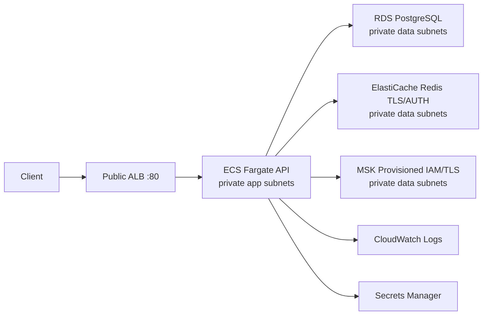

# CampusReserve AWS demo infrastructure

This directory defines a deliberately small, short-lived AWS demo environment.
It is not provisioned by this repository yet. Review current AWS pricing and
the Terraform plan before any apply; no cost estimate in this document should
be inferred.

## Architecture and tradeoffs



The VPC (`10.40.0.0/16` by default) spans two Availability Zones, with two
public, two private application, and two isolated private data subnets. The
ALB is internet-facing; Fargate tasks have no public IP. Data services have no
public route or public ingress. Security groups permit only ALB → API → each
required data service. One NAT Gateway is intentionally shared by both app
subnets to reduce demo cost, sacrificing NAT AZ resilience.

The design uses one ECS task, single-AZ RDS, one Redis node, and two small MSK
brokers running Kafka 3.9.x. There are no replicas, RDS Multi-AZ, autoscaling,
WAF, custom domain, managed Grafana, or managed Prometheus. These are
intentional demo cost/HA tradeoffs, not production recommendations.

RDS manages its master password in Secrets Manager. Redis uses a generated
AUTH token stored in Secrets Manager; because the generated value is also in
Terraform state, the remote encrypted state bucket and its access policy are
sensitive. ECS injects database and Redis passwords as task-definition
`secrets`, not literal environment values. The application task role has
MSK data-plane permissions only; the execution role separately pulls ECR
images, writes logs, and fetches the two startup secrets.

The AWS profile configures the Kafka client for `SASL_SSL` and `AWS_MSK_IAM`.
MSK bootstrap brokers are supplied as a full comma-separated runtime value.

## Cost warning

NAT Gateway, RDS, ElastiCache, MSK, ALB, ECS/Fargate, CloudWatch retention,
and stored ECR images can continue billing while provisioned. Check current
AWS pricing for the chosen region before applying. Set both the optional budget
email and a monthly budget amount to create an alert; it is not a hard spending
cap.

Use synthetic data only. The demo ALB is HTTP because no domain/certificate is
configured; do not enter real personal information. A production deployment
needs HTTPS and a custom domain.

## Safe deployment lifecycle

### A. Prerequisites

Install Terraform and AWS CLI, configure an AWS account and region, and review
pricing. Confirm identity before any state-changing command:

```bash
aws sts get-caller-identity
```

### B. Bootstrap remote state

The separate `bootstrap/` configuration creates only an encrypted, versioned,
publicly blocked state bucket. Choose a globally unique bucket name. Do not
run these commands until the configuration and billing profile are reviewed:

```bash
cd infra/aws/bootstrap
terraform init
terraform plan -var='state_bucket_name=unique-name-here'
terraform apply -var='state_bucket_name=unique-name-here'
```

### C. Main stack bootstrap

Copy `backend.hcl.example` to the ignored `backend.hcl` and replace its bucket
placeholder. Copy `terraform.tfvars.example` to an ignored `.tfvars` file, and
keep `ecs_desired_count = 0` for this first deployment: ECR has no image yet.

```bash
cd infra/aws
terraform init -backend-config=backend.hcl
terraform fmt -check
terraform validate
terraform plan -var-file=demo.tfvars
```

Carefully review that plan, the selected AWS account and region, and current
AWS pricing. Only then manually run:

```bash
terraform apply -var-file=demo.tfvars
```

This first apply creates the AWS infrastructure, including the ECR repository,
but starts zero ECS tasks because the API image has not been pushed yet. AWS
resources become billable after this apply. Use an RDS engine version only
after verifying it is available in the chosen region. The default leaves it to
RDS rather than claiming PostgreSQL 18 is available everywhere.

### D. Push an immutable ECR image

After the first apply creates ECR, authenticate, build the existing CRV-014
Dockerfile, and push a Git commit SHA tag (not only `latest`):

```bash
AWS_REGION=us-east-1
ACCOUNT_ID=$(aws sts get-caller-identity --query Account --output text)
IMAGE="$ACCOUNT_ID.dkr.ecr.$AWS_REGION.amazonaws.com/campusreserve-reservation-api"
IMAGE_TAG=$(git rev-parse --short=12 HEAD)
aws ecr get-login-password --region "$AWS_REGION" | docker login --username AWS --password-stdin "$ACCOUNT_ID.dkr.ecr.$AWS_REGION.amazonaws.com"
docker build -t "$IMAGE:$IMAGE_TAG" apps/reservation-api
docker push "$IMAGE:$IMAGE_TAG"
```

### E. Start the application

Set `container_image_tag` to that pushed immutable SHA and
`ecs_desired_count = 1`, then run and review a second plan before manually
applying it:

```bash
terraform plan -var-file=demo.tfvars
terraform apply -var-file=demo.tfvars
```

Wait for ECS service stability and a healthy ALB target.

### F. Smoke validation

Against `application_base_url`, use fake attendee details only. Check:

- `/actuator/health/readiness`
- `/api`
- creating an event, creating a reservation, and reading the event
- ECS healthy task state and CloudWatch API logs
- RDS, Redis, and MSK connectivity through the application behavior

### G. Teardown

Before teardown, reconfirm account and region, then inspect the destroy plan:

```bash
aws sts get-caller-identity
terraform plan -destroy -var-file=demo.tfvars
terraform destroy -var-file=demo.tfvars
```

Afterward check for remaining NAT Gateway, ALB, ECS tasks/service, RDS,
ElastiCache, MSK, ECR images, and CloudWatch log retention. The RDS
`skip_final_snapshot` setting is demo-only and is not suitable for production
data retention.
